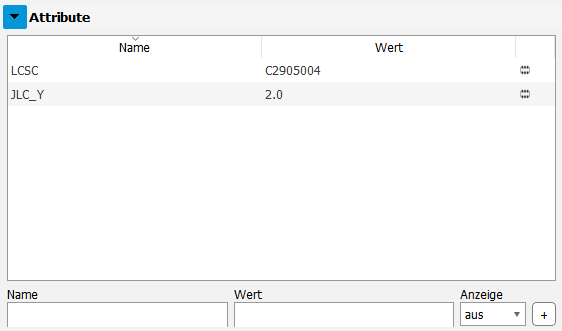

# jlcpcb-eagle
EAGLE cad helpers for JLCPCB (https://jlcpcb.com) production and assembly services

## General info

Rules and scripts have been tested under EAGLE cad 9.5.

They're provided AS IS, with no warranty. Any feedback is greatly appreciated and
can be provided via issue tickets.

### Installation

Copy each file in their respective folders (USER_HOME/Documents/EAGLE/).

## CAM jobs

The details of these CAM jobs are covered in article [How to Generate Gerber and Drill Files in Autodesk Eagle](https://support.jlcpcb.com/article/137-how-to-generate-gerber-and-drill-files-in-autodesk-eagle), so they must be used together.

The jobs follow the naming guidelines defined here: https://support.jlcpcb.com/article/29-suggested-naming-patterns

They also include tCream/bCream solderpaste layers that could be used for the stencil service.

### Eagle 8.6.0 to 9.6.2

* cam/jlcpcb_2_layer_v9.cam : For 2-layer boards
* cam/jlcpcb_4_layer_v9.cam : For 4-layer boards
* cam/jlcpcb_6_layer_v9.cam : For 6-layer boards

### Eagle 7.2 to 8.5.2

* cam/jlcpcb_2_layer_v72.cam : For 2-layer boards
* cam/jlcpcb_4_layer_v72.cam : For 4-layer boards
* cam/jlcpcb_6_layer_v72.cam : For 6-layer boards

### Eagle 7.1 and Lower

For Eagle 5, 6 and 7.1

* cam/jlcpcb_2_layer_v6.cam : For 2-layer boards
* cam/jlcpcb_4_layer_v6.cam : For 4-layer boards
* cam/jlcpcb_6_layer_v6.cam : For 6-layer boards

## Design rules

* design rules/jlcpcb-2layers.dru: 2-layers version, 35u copper, 1.6mm board thickness

Mainly based on EAGLE's standard design rules, it adds the declared JLCPCB's capabilities listed
here: https://jlcpcb.com/capabilities/Capabilities

Note: annular ring for pads aren't minimal, in order to allow proper solderability of TH components

## ULPs

### BOM/CPL Exporter

* BOM: Bill of Materials
* CPL: Component Placement List (i.e. Pick and Place file)

The smta exporter ULP can be used to quicken the process of creating the required files for the SMT assembly service.

#### Files

* ulps/jlcpcb_smta_exporter.ulp: For Eagle 9
* ulps/jlcpcb_smta_exporter_v7.ulp: Tested in Eagle 7.7.0

#### Usage

Observe the following:

1. it must be executed from the board editor
2. it asks for the layers to process, this must be consistent with the ordering process
3. it asks for a directory where to export the two files
4. the two files will be named ```<boardname>_ASSEMBLY_bom.csv``` and ```<boardname>_ASSEMBLY_cpl.csv```
5. components rotations can differ depending on footprint. Check them visually on the online gerber viewer once uploaded the files


### Adjust Rotation and Position
The ULP can extract LCSC part ordering numbers from the packages attributes. The attribute must be named _LCSC_PART_ or _LCSC_ and it should contain the order code found in the parts library https://jlcpcb.com/parts (eg: C25804).

The ULP can also manually rotate the angle in the CPL output file. The attribute must be named _JLC_ROTATION_ or _JLC_ROT_. For example, if a part's angle in set to 90 and it's attribute _JLC_ROTATION_ is set to 180, the angle in the final CPL file will be set to 270.

Furthermore, the Position of the parts can be modified relatively, as there may be an offset to the relative origin. Note that the Offset is also relative to the rotation. The offsets shift an part with rotation of 0° in positive y-direction using the attribute _JLC_Y_ and in positive y-direction using the attribute _JLC_X_.


